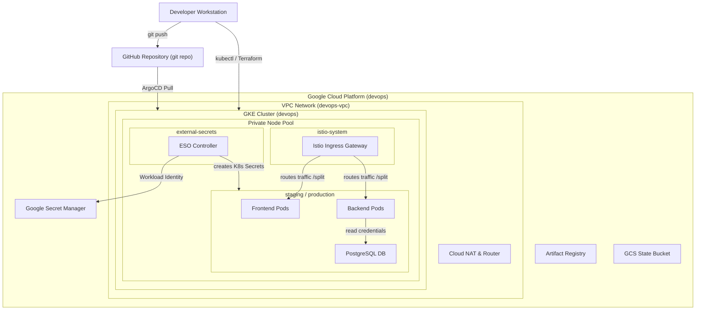

# GKE Kubernetes Cluster GitOps Platform

> ⚡ **Looking for a quick, step-by-step setup guide?** View the [Quickstart Guide (TL;DR)](readmeTL;DR.md).

This project provides an automated, production-grade Kubernetes platform running on Google Cloud Platform (GCP). It leverages Terraform to provision a private Google Kubernetes Engine (GKE) cluster, custom VPC, Artifact Registry, and Google Secret Manager, and uses GitOps (ArgoCD) to orchestrate progressive delivery (Argo Rollouts) and service mesh security (Istio).

The system utilizes the **External Secrets Operator (ESO)** integrated with **GCP Secret Manager** via **Workload Identity**, providing secure, zero-hardcoding secrets management without local configurations or script-based injection.

---

## 1. Architectural Overview

The deployment architecture on Google Cloud Platform is structured as follows:



### Infrastructure & Platform Components
1.  **Google Kubernetes Engine (GKE)**: A standard private cluster running Kubernetes v1.29+ with GKE Workload Identity enabled.
2.  **Custom VPC & Cloud NAT**: Ensures GKE nodes do not have public IP addresses and communicate securely with external resources through a managed Cloud NAT Gateway.
3.  **Google Artifact Registry (GAR)**: Private registry used to store and version frontend and backend Docker images.
4.  **Google Secret Manager (GCSM)**: Secure cloud vault storing database admin credentials.
5.  **External Secrets Operator (ESO)**: Retrieves database credentials from GCP Secret Manager dynamically, resolving them using Workload Identity to generate Kubernetes secret resources.
6.  **Istio Service Mesh**: Enforces STRICT mTLS namespace-wide and provides granular gateway routing, header-based canary splits, and staging fault injection rules.
7.  **ArgoCD & Argo Rollouts**: Performs declarative git-based deployments. Argo Rollouts manages progressive canary releases with step-by-step weight progression (10% -> 50% -> 100%).
8.  **Prometheus & Grafana (kube-prometheus-stack)**: Scrapes cluster and Istio metrics for monitoring.

---

## 2. Setup & Bootstrapping

### Prerequisites
*   Google Cloud SDK (`gcloud` CLI) authenticated to your GCP account.
*   Terraform (v1.0.0+) and Helm (v3+) installed.
*   GitHub CLI (`gh` CLI) authenticated to push configuration files.

### Bootstrap Deployment
1.  **Configure Local Environment Variables**:
    Create a `secrets/` directory and copy the template:
    ```bash
    mkdir -p secrets
    cp example.env secrets/.env
    ```
    Open `secrets/.env` and fill out your GCP configurations.

2.  **Run Master Bootstrap Script**:
    Execute the all-in-one bootstrap orchestrator:
    ```bash
    ./scripts/bootstrap.sh
    ```
    This script initializes the Terraform state backend, applies the IaC plan, builds/pushes application images, deploys all core Helm charts, renders environment templates, pushes the code to the private GitOps repository, and applies the ArgoCD ApplicationSet.

3.  **Configure Domain Name Resolution**:
    Retrieve the external IP of the Istio Ingress Gateway:
    ```bash
    kubectl get svc -n istio-system istio-ingress
    ```
    Map the domain `app.local` to this IP in `/etc/hosts` (or Windows hosts file):
    ```bash
    # Append to /etc/hosts
    <INGRESS_IP> app.local
    ```

---

## 3. Operations Verification

### Persistent Storage (PVC) Test
1.  Navigate to the **Database & PVC** tab on the dashboard (`http://app.local`).
2.  Click **Register New Visit**. The counter increments by sending a transaction to the PostgreSQL database.
3.  Simulate a database failure by terminating the PostgreSQL pod:
    ```bash
    kubectl delete pod -l app=postgres -n staging
    ```
4.  Once the pod restarts, refresh the dashboard. The visit counter is preserved, verifying persistent volume storage backings (balanced persistent disk storage class).

### Ingress Canary Split & Fault Injection Test
1.  Navigate to the **Diagnostics & Canary** tab on the dashboard.
2.  Click **Trigger 100 Requests**. The dashboard fires 100 HTTP requests in parallel to `/api/visit`.
3.  The split visualizer displays traffic split routing: NGINX/Istio routes ~90% to `v1-stable` and ~10% to `v2-canary`.
4.  To verify fault injection in the staging namespace:
    ```bash
    # Staging VirtualService includes a fault delay rule (20% of traffic delayed by 3s)
    # The load test latency metric on the staging tab will display a rise in average delay.
    ```

---

## 4. Ops Control Panel: Security & Canary Controls

The platform features an administrative dashboard (`http://app.local`) for GKE operations telemetry, auth management, and deployment control.

### 4.1. Secure Session Authentication Flow
To prevent unauthorized cluster manipulation (e.g. promoting or undoing rollouts), administrative actions are protected by a stateful auth flow:
1. **API Key Storage**: The master API key is stored in GCP Secret Manager (`backend-api-key`) and mapped via External Secrets Operator to GKE pod environment variables (`BACKEND_API_KEY`).
2. **HttpOnly Session Cookies**: Authenticating via `/api/login` sets a secure `ops-token` cookie with the `HttpOnly`, `SameSite=Lax`, and `Secure` attributes (enabled on HTTPS or localhost contexts). This prevents client-side scripting (XSS) from reading or stealing the token.
3. **Session Verification**: The frontend queries the `/api/cluster/auth-check` endpoint during metrics polling. If the cookie is absent or invalid, the UI locks itself, disabling all admin buttons and hiding the **Telemetry & Rollout Control** panel.
4. **Logout**: Clicking the sidebar **Logout** button triggers a POST request to `/api/logout`, which clears the `ops-token` cookie from the client browser and redirects to the locked state.
5. **Authorization Policy Enforcement**: An Istio `AuthorizationPolicy` (`deny-external-admin`) acts as a network-level firewall. It blocks any admin POST requests (e.g., version switching, promotions, or rollbacks) that originate outside private namespace subnets or internal proxy channels, ensuring external clients cannot attempt authentication bypassing.

### 4.2. Rollout Control Panel (Button Functions)
The **Telemetry & Rollout Control** card provides five primary deployment control actions:

*   **Force Canary Route (Checkbox)**:
    *   *Action*: When checked, all traffic load requests sent from the client-side load simulator will inject the `X-Canary: true` HTTP request header.
    *   *Effect*: Istio Ingress intercepts this header and overrides default rollout weights, routing 100% of these requests directly to the `backend-canary-service` (the canary version) for immediate diagnostic telemetry.
*   **Deploy v2 (Button)**:
    *   *Action*: Triggers a patch request that starts a progressive rollout step of the backend service to `v2-canary` at a 20% traffic split.
    *   *Effect*: Launches canary pods and signals Istio to split 80% stable / 20% canary traffic.
*   **Promote v2 (Button)**:
    *   *Action*: Promotes the active canary version fully to stable by skipping remaining analysis steps.
    *   *Effect*: Scales down older replicasets and shifts 100% of traffic to the new version.
*   **Rollback v1 (Button)**:
    *   *Action*: Triggers a quick rollback to `v1-stable`.
    *   *Effect*: Instantly patches the active rollout back to the v1 image configuration and resets routing weights.
*   **Undo Rollback (Button)**:
    *   *Action*: Executes the `kubectl argo rollouts undo backend` command inside GKE using the mounted service account permissions.
    *   *Effect*: Reverts the active rollout state to its previous revision, bringing back the stable pod configuration.
*   **Switch Version (Button)**:
    *   *Action*: Takes a custom text tag from the input box (e.g. `v2-canary`) and patches the rollout.
    *   *Effect*: Allows testing arbitrary container versions. The backend validates the input string to prevent command injection.

---

## 5. Teardown & Clean Destruction
To cleanly delete all workloads, release GCP LoadBalancers, delete persistent disk storage blocks, and destroy all GKE cluster and network resources to avoid GCP charges:
```bash
./scripts/destroy.sh
```

---

## 6. Design Decisions & Trade-Offs
*   **External Secrets Operator vs. Sealed Secrets**: Sealed Secrets requires encrypting secrets into Git, which leaks metadata and is hard to rotate. ESO decouples secrets from Git, resolving them at runtime from Google Secret Manager.
*   **Workload Identity vs. Service Account Keys**: Exporting GCP Service Account keys as Kubernetes secrets presents a risk of key exposure. GKE Workload Identity maps Kubernetes ServiceAccounts to GCP IAM Service Accounts dynamically, offering metadata-driven security with zero key management.
*   **Private GKE Node Pools**: Private GKE clusters block direct external ingress to GKE node instances, forcing all internet communication through Cloud NAT. This drastically reduces the attack surface of the control plane and nodes.

---

## 7. License
Distributed under the MIT License. See [LICENSE](LICENSE) for details.
